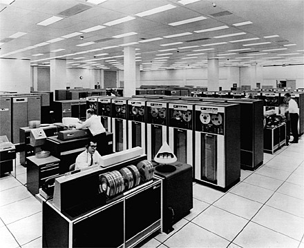
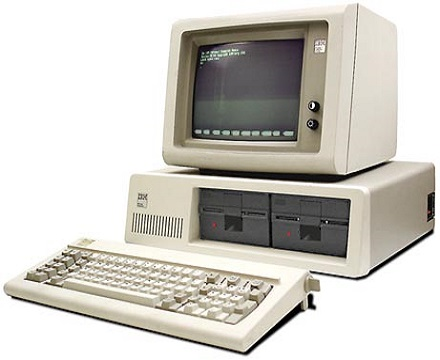
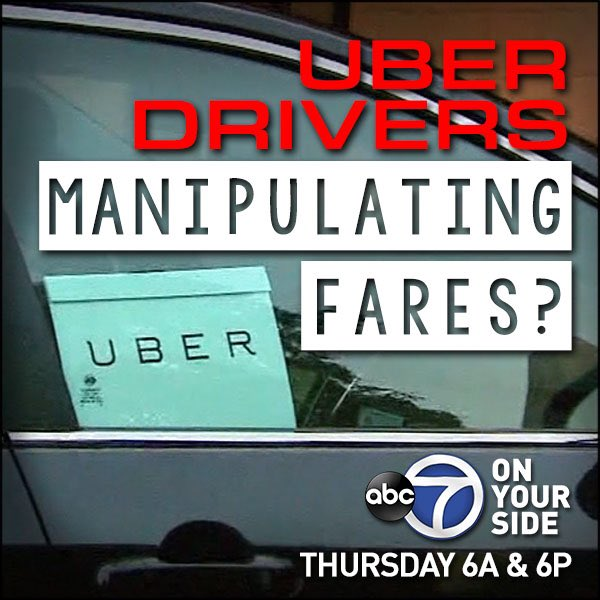

```{r css setting, include = FALSE}
# Related csses are generated in css/  
#eval(parse('set-css.R', encoding="UTF-8"))
source('small_bites.R')
#options(htmltools.dir.version = FALSE)
```

layout: true
class: top, left, spaced, top, animated, fadeIn

---

background-image: url(img/death_knight.gif)
background-size: cover

---

background-image: linear-gradient(rgba(0,0,0,.7), rgba(0,0,0,.7)),url(img/ncsoft2.jpg)
background-size: cover

## Who am I  
<br>
<br>
<br>
### `r icon_rocket()` PhD in Economics (evolutionary game theory)
### `r icon_rocket()` Data Center, Lead (Since 2019)

---

# Today Talk  

### &emsp; `r icon_rocket()` What we are doing? 
### &emsp; `r icon_rocket()` What is so special with 'game' data?
### &emsp; `r icon_rocket()` Sharing my experience to work with data
### &emsp; `r icon_rocket()` Q & A (if there is any)

---
background-image: url(img/Data-Center_wrong.jpg)
background-size: cover
class: center, middle, animated, fadeIn

# Data Center?

---
background-image: linear-gradient(rgba(0,0,0,.7), rgba(0,0,0,.7)),url(img/Data-Center_wrong.jpg)
background-size: cover
class: center, middle, animated, fadeIn

# It's just a name of devision. 

---
# Data Center(DC) of NCSOFT

## The work of DC includes 
### &emsp; `r icon_check()` mananging data and its softwere infrastructure
### &emsp; `r icon_check()` doing analytics with data 
### &emsp; `r icon_check()` communucating insights & helping decision making.
  
---
class: left, top
background-image: url(img/dc-infra.png)
background-size: contain


# Data Volume
---

background-image: linear-gradient(rgba(0,0,0,.7), rgba(0,0,0,.7)),url(img/question-marks.jpg)
background-size: cover

# 질문!  
<br>
## "경제학 배우면 먼저 떠오르는 단어는?" 

--

#### &emsp;`r icon::fa("comments", color="yellow")` 아마도 가격(PRICE)? 가격이란 무엇인가요? 

--

#### &emsp;`r icon::fa("comments", color="yellow")` 어떤 재화/서비스의 가격이 떨어졌다는 것은? 

--

#### &emsp;`r icon::fa("comments", color="yellow")` 한 재화의 하락은 어떻게 다른 영역으로 퍼져나갑니까? 

---

# 보완재와 네트워크 효과

### 재화 간 관계  
+ 보완재 vs. 대체재 
+ AI/알고리듬은 보완재? 대체제? 

--
  
### 망 외부성 
+ 간단히 말하면 "많이 쓸수록 좋아진다!" 
+ 외부성이란 무엇일까? 
+ 왜 외부성일까? 
+ 규모의 경제 (Economies of scale)

--

### `r icon::ii("checkmark-circled")` "소프트웨어와 알고리듬은 망 외부성을 지니기 쉽다."

---

# Back to the Future 

.pull-left[
IBM 7094

]
.pull-right[
IBM 5150

]

---

# AI라고 다를까? 


.pull-left[
Garry Kasparov vs. Big Blue 

]
.pull-right[
Lee Se-dol vs Alpha Go 

]

---

layout:false
class: center, middle
background-image: url(img/ai_investment.png)
background-size: contain

---

layout:false
class: center, middle
background-image: url(img/ai_investment_2.png)
background-size: contain

---

background-image: linear-gradient(rgba(0,0,0,.7), rgba(0,0,0,.7)),url(img/factory.gif)
background-size: cover
class: center, middle, animated, fadeIn


# Age of AI = Age of Data!

---


# 인공지능 무엇이 바뀌었는가? 

### 인공신경망(artificial neural net)

+ Mcculloch & Pitts (1943) 
+ 인간의 신경망이 작동하는 방식을 본딴 algorithm logic 

```{r out.width = '70%', echo=FALSE, fig.align='center'}
# url
#knitr::include_graphics("http://bit.ly/arm-greens") 
# local
knitr::include_graphics("img/artificial_neural_network_1-791x388.jpg")
```

--

#### &emsp;&emsp;&emsp;&emsp;&emsp;&emsp;(천재적인 발상이었지만...)
 
---

background-image: linear-gradient(rgba(0,0,0,.7), rgba(0,0,0,.7)),url(img/night-king-hbo-got-hack-740x432.png)
background-size: cover
class: center, middle, animated, fadeIn

# AI Winter of 80s (maybe till 90s)

---

# AI의 부활 

### 홍수처럼 쏟아진 data! 

* Internet! Internet! Internet!
* Yahoo, Google, Facebook...
* 엄청난 량의 데이터가 쌓이기 시작 

--

### 쉬워진 하드웨어의 확장

* Distributed & Cloud computing 
* 범용 머신을 통해 한계를 넘어설 수 있는 여지가 확보 

---

layout:false
class: center, middle
background-image: url(img/Internet-users-by-world-region.png)
background-size: contain

---

background-image: linear-gradient(rgba(0,0,0,.7), rgba(0,0,0,.7)),url(img/factory.gif)
background-size: cover
class: center, middle, animated, fadeIn

# To Be Economist or Not $\cdots$

---

# AI가 싸지면 어떤 일들이 생길까? 

### 시장 불완전성의 변화 
* 가격 조정과정의 마찰 감소 
* 정보 문제의 상당한 완화  

--

### 새로운 경제 규제의 이슈 
* 우버, 아마존, 구글의 알고리듬은 공정한가? 
* 반독점의 후생 원칙은 빅데이터/AI 시대에 어떻게 적용될 것인가?  

--

<br> 
###  `r icon::ii("checkmark-circled")` "경제학은 여전히 중요하겠지만, 경제학 전공자는..." 

---
# Incentives in the Other side... 

.pull-left[
Effort to cut insurance premium...

]
.pull-right[
Uber dirvers, unite... 

]


---

# AI의 시대를 살아갈 경제학도에게 

### AI 시대에도 '실증'은 여전히 유효 
* 통계학, 계량경제학 열심히 들으시라.
* 데이터를 많이 다뤄보시라. 

--

### Technologies matter!
* 경제학 외부의 발전과 경향에도 곁눈질을 하시라. 
* 다양한 방법으로 데이터를 들여다보시라.  

--

### Economic theory still matters! 
* 예측과 설명은 다른 것이다. (상관관계 vs 인과관계)
* 사회현상의 경우 원인을 파악하는 것이 중요 
* From Black-box model to Interpreatble ones 

---

# "거 데이터 하기 좋은 시절이구만~" 

### 데이터? 

- [Google dataset search](https://toolbox.google.com/datasetsearch)
- [공공데이터 포털](https://www.data.go.kr/)
- [Kaggle.com](https://www.kaggle.com)

--

### 프로그래밍 툴? 

- R, Python과 그 생태계는 모든 것이 공짜 점심이다. 
  + 먹기만 하면 됨? 
- [Google Colabs](https://colab.research.google.com)

---
layout:false
class: center, middle

# 고맙습니다!


---
layout:false
class: center, middle
background-image: url(img/penguin.gif)
background-size: cover

# Q & A